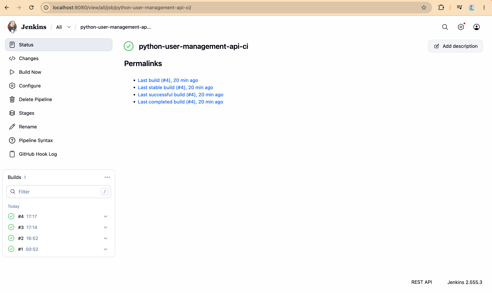
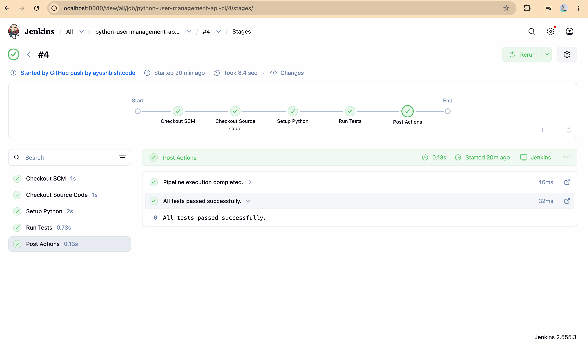
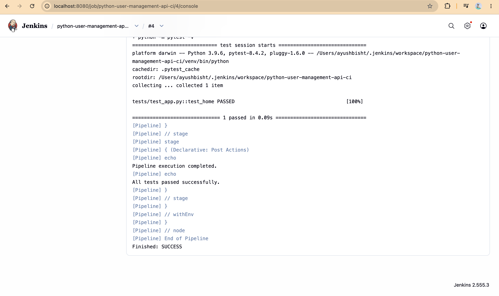
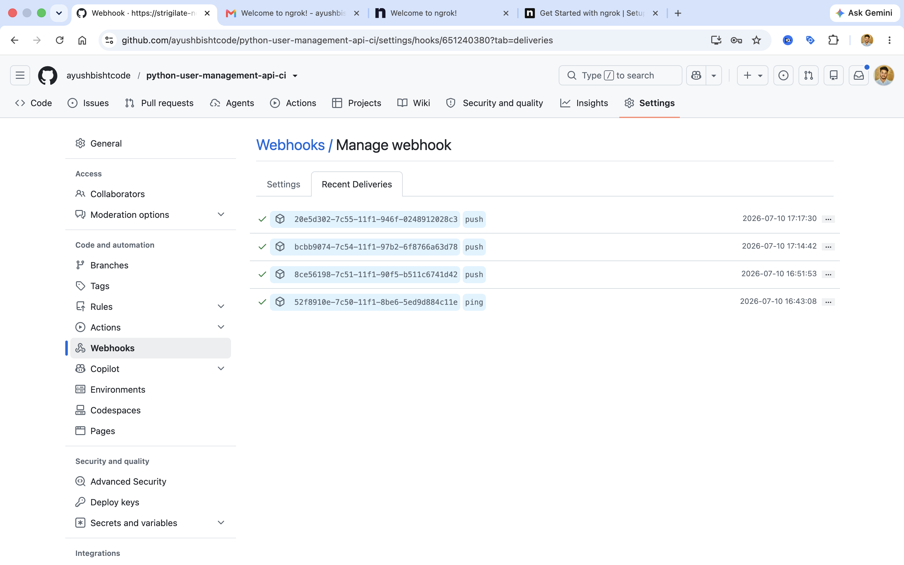
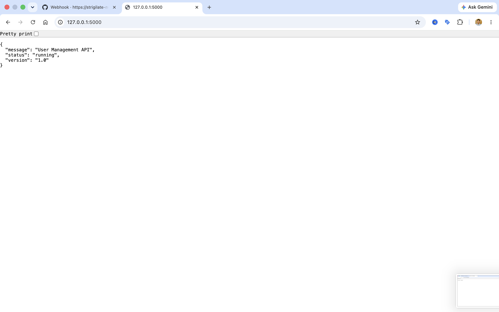

# 🚀 Python User Management API - Jenkins CI Pipelinee

A beginner-friendly DevOps project demonstrating **Continuous Integration (CI)** using **Jenkins**, **GitHub**, **Flask**, and **pytest**.

The project contains a simple Flask REST API with automated testing. Every code push to GitHub automatically triggers a Jenkins Pipeline that checks out the source code, creates a Python virtual environment, installs dependencies, and executes automated tests.

---

# 📌 Project Overview

Continuous Integration (CI) is a DevOps practice where every code change is automatically validated before it is merged or deployed.

This project demonstrates a complete CI workflow using:

- Jenkins Pipeline
- GitHub Repository
- GitHub Webhooks
- Python Virtual Environment
- Flask REST API
- Pytest Automated Testing

Whenever code is pushed to GitHub, Jenkins automatically:

1. Checks out the latest source code
2. Creates a new Python virtual environment
3. Installs project dependencies
4. Executes automated tests
5. Reports the build as **SUCCESS** or **FAILURE**

---

# 🏗 Project Architecture

```text
                    Developer
                        │
                   git push
                        │
                        ▼
                GitHub Repository
                        │
                 GitHub Webhook
                        │
                        ▼
                 Jenkins Pipeline
                        │
        ┌───────────────┴────────────────┐
        │                                │
 Checkout Source Code                    │
        │                                │
 Create Python Virtual Environment       │
        │                                │
 Install Dependencies                    │
        │                                │
 Run Pytest                              │
        │                                │
        └───────────────┬────────────────┘
                        ▼
                Build Result
             SUCCESS / FAILURE
```

---

# 🚀 Features

- Flask REST API
- Health Check Endpoint
- Automated Unit Testing
- Jenkins Declarative Pipeline
- Python Virtual Environment
- GitHub Integration
- GitHub Webhook Trigger
- Continuous Integration Workflow

---

# 🛠 Technologies Used

| Technology      | Purpose                 |
| --------------- | ----------------------- |
| Python 3        | Programming Language    |
| Flask           | REST API Framework      |
| pytest          | Automated Testing       |
| Jenkins         | Continuous Integration  |
| Git             | Version Control         |
| GitHub          | Source Code Hosting     |
| GitHub Webhooks | Automatic Build Trigger |

---

# 📂 Project Structure

```text
python-user-management-api-ci/
│
├── app/
│   ├── __init__.py
│   └── app.py
│
├── tests/
│   └── test_app.py
│
├── screenshots/
│
├── requirements.txt
├── Jenkinsfile
├── README.md
└── .gitignore
```

---

# ⚙️ Installation

## Clone Repository

```bash
git clone https://github.com/ayushbishtcode/python-user-management-api-ci.git
```

```bash
cd python-user-management-api-ci
```

---

## Create Virtual Environment

### macOS / Linux

```bash
python3 -m venv venv
```

Activate it

```bash
source venv/bin/activate
```

### Windows

```bash
python -m venv venv
```

```bash
venv\Scripts\activate
```

---

## Install Dependencies

```bash
pip install -r requirements.txt
```

---

# ▶️ Run the Application

```bash
python app/app.py
```

Open:

```
http://localhost:5000
```

---

# 📡 API Endpoints

## Home

```
GET /
```

Response

```json
{
  "message": "User Management API",
  "status": "running",
  "version": "1.0"
}
```

---

## Health Check

```
GET /health
```

Response

```json
{
  "status": "healthy"
}
```

---

# ✅ Run Automated Tests

```bash
python -m pytest -v
```

Expected Output

```text
============================= test session starts =============================

tests/test_app.py::test_home PASSED

============================== 1 passed ==============================
```

---

# ⚙ Jenkins Pipeline

The Jenkins Pipeline performs the following stages:

### Checkout Source Code

Downloads the latest code from GitHub.

### Setup Python

Creates a new Python virtual environment and installs project dependencies.

### Run Tests

Executes all pytest test cases.

### Post Actions

Displays the build result.

Pipeline Flow

```text
Checkout
      │
      ▼
Setup Python
      │
      ▼
Install Dependencies
      │
      ▼
Run pytest
      │
      ▼
SUCCESS / FAILURE
```

---

# 🔔 GitHub Webhook

The project uses **GitHub Webhooks** to automatically trigger Jenkins whenever code is pushed to the repository.

Workflow:

```text
Developer
      │
git push
      │
      ▼
GitHub Repository
      │
Webhook
      │
      ▼
Jenkins
      │
Pipeline Starts
      │
Checkout
      │
Setup Python
      │
Run Tests
      │
SUCCESS
```

---

# 📸 Screenshots

## Jenkins Dashboard



---

## Successful Pipeline



---

## Jenkins Console Output



---

## GitHub Webhook



---

## Flask API



---

# 📚 What I Learned

Through this project I learned:

- Jenkins Installation
- Freestyle Jobs
- Pipeline Jobs
- Jenkinsfile
- Declarative Pipeline
- Jenkins Workspace
- Python Virtual Environment
- Flask Application Development
- REST API Basics
- Automated Testing using pytest
- GitHub Integration
- GitHub Webhooks
- Continuous Integration Fundamentals

---

# 🚀 Future Improvements

- Add CRUD operations for users
- Connect PostgreSQL database
- Dockerize the application
- Build Docker images using Jenkins
- Push Docker images to Docker Hub
- Deploy to AWS EC2
- Add SonarQube code quality analysis
- Add code coverage reporting
- Build a complete CI/CD pipeline

---

# 👨‍💻 Author

**Ayush Bisht**

DevOps Engineer | Python | Jenkins | Docker | AWS | Kubernetes

GitHub:
https://github.com/ayushbishtcode

---

## ⭐ If you found this project helpful, consider giving it a Star on GitHub.
